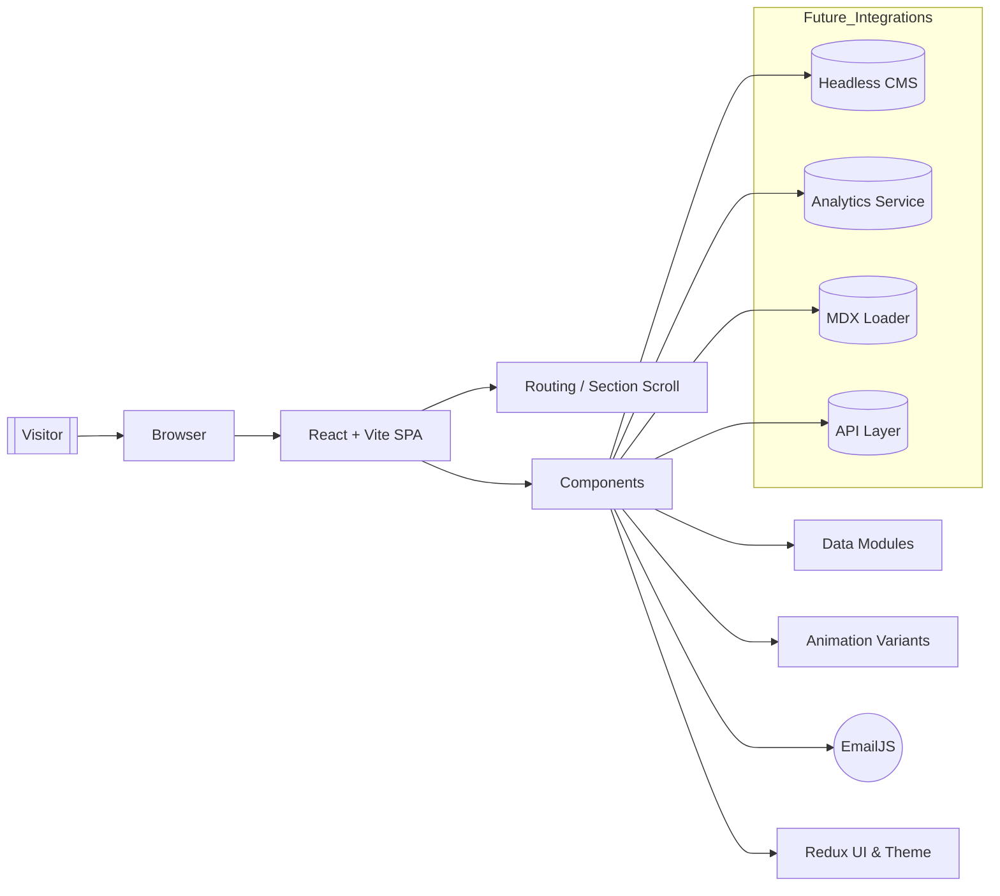
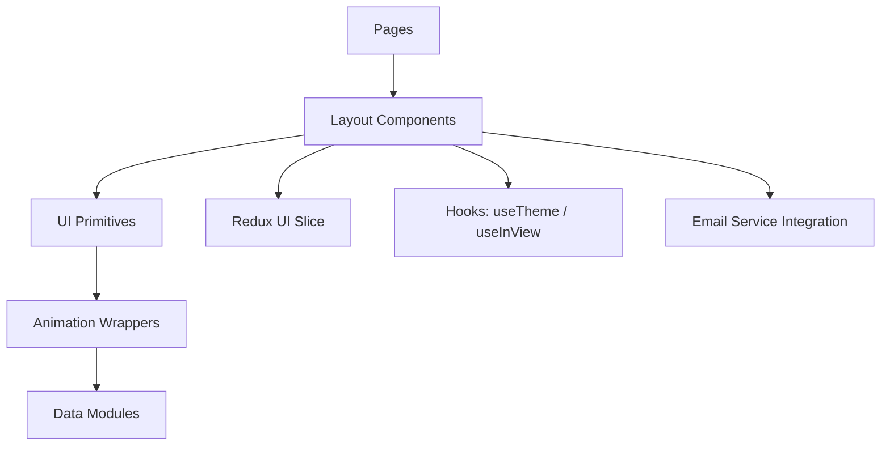
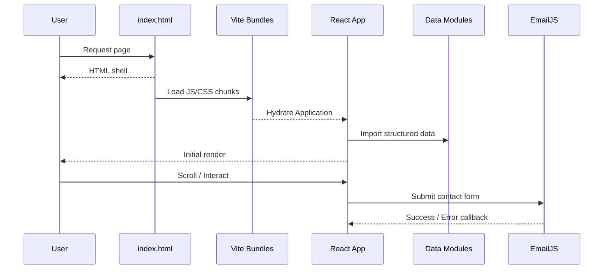

# 🚀 Raghav Kathuria's Portfolio (sb22)

> A professional, high‑performance developer portfolio built with a modern React + Vite + TailwindCSS stack.  
> Showcases projects, certifications, technical skills, and contact channels with clean UX, animations, and scalable architecture.

<p align="center">
  <a href="https://masterji27.github.io/sb22/" target="_blank">
    
  </a>
</p>

<p align="center">
  
  
  
  
  
  
  
  
  <!-- Optional future badges:
  
  
  -->
</p>

---

## 🧭 Executive Overview
This portfolio is a modular, extensible single‑page application rather than a static HTML page.  
Core goals:
- High performance (Vite bundling, fast cold starts)
- Clean component architecture & reusable animation patterns
- Data‑driven content (projects, certifications, skills)
- Accessible & theme ready (dark mode)
- Future‑friendly (blog, analytics, serverless enhancements)

---

## 🗺️ Site Map
| Section | Purpose | Status |
|---------|---------|--------|
| Home / Hero | Branding & introductory context | ✅ |
| Projects | Highlight representative work | ✅ |
| Certifications | Credibility & proof of skill | ✅ |
| Contact | Direct communication channel | ✅ |
| Skills (inline) | Tech stack positioning | ✅ |
| Blog (future) | Long-form writing & thought leadership | ⏳ |

---

## 🖼️ Screenshots (Optional)
<!--
Add PNG/JPG files to: public/assets/screens/
Uncomment when ready.

<details>
  <summary><strong>View UI Gallery</strong></summary>
  <br>
  <p align="center">
    
    
  </p>
  <p align="center">
    
    
  </p>
</details>
-->

---

## 🧩 Architecture & Flow

### High-Level Component & Data Flow


### Component / Layer Responsibility


### Performance Lifecycle


---

## 🛠 Tech Stack Summary
| Layer | Tools / Libraries | Notes |
|-------|-------------------|-------|
| Core Framework | React 18 + Vite | Fast HMR & build |
| Styling | TailwindCSS | Utility-first |
| State | Redux Toolkit | UI state & future expansion |
| Animations | Framer Motion | Centralized variants |
| Forms | EmailJS | Client-only send |
| Deployment | GitHub Pages | Static hosting |
| Tooling (opt) | ESLint / Prettier / Husky | Quality & consistency |

---

## 📂 Directory Structure
```
sb22/
├── public/
│   ├── favicon.ico
│   ├── robots.txt
│   └── assets/
│       ├── images/
│       └── screens/
├── src/
│   ├── components/
│   │   ├── layout/
│   │   ├── ui/
│   │   ├── animations/
│   │   └── composite/
│   ├── pages/
│   ├── data/
│   ├── hooks/
│   ├── store/
│   ├── services/
│   ├── utils/
│   ├── styles/
│   ├── App.jsx
│   ├── main.jsx
│   └── routes.jsx (optional)
├── .github/workflows/
├── package.json
├── tailwind.config.js
├── postcss.config.js
├── vite.config.js
└── README.md
```

---

## 🚀 Quick Start
```bash
git clone https://github.com/MasterJi27/sb22.git
cd sb22
npm install
npm run dev

# Production build + local preview
npm run build
npm run preview
```

### Optional Deploy (gh-pages)
```bash
npm install --save-dev gh-pages
npm run build
npx gh-pages -d dist
```

---

## 🔧 Suggested Scripts
```json
{
  "scripts": {
    "dev": "vite",
    "build": "vite build",
    "preview": "vite preview",
    "lint": "eslint src --ext .js,.jsx --max-warnings=0",
    "format": "prettier -w .",
    "deploy": "vite build && gh-pages -d dist"
  }
}
```

---

## 🎨 Design & UX System
| Aspect | Strategy |
|--------|----------|
| Theming | `dark` class + localStorage |
| Spacing | 4/8 px scale via Tailwind |
| Motion | Reusable variants (fadeIn, slideIn) |
| Semantics | `<header> <main> <section> <footer>` |
| Accessibility | Keyboard focus & contrast awareness |
| Responsiveness | Mobile-first, constrained max width |

---

## 🧠 Example Data Definition
```js
// src/data/projects.js
export const projects = [
  {
    id: 'real-estate-ai',
    title: 'AI Real Estate Valuation System',
    description: 'Enterprise-grade valuation & investment analytics using ML + Gemini.',
    stack: ['Streamlit', 'Python', 'Gemini', 'XGBoost'],
    links: {
      demo: 'https://app0027.streamlit.app/',
      repo: 'https://github.com/MasterJi27/AI-Based-Real-Estate-Valuation-System'
    },
    featured: true,
    tags: ['AI', 'ML', 'Analytics']
  }
];
```

---

## 📈 Optimization & Production Checklist
| Area | Current | Next Step |
|------|---------|-----------|
| Bundling | Vite optimized | Add bundle visualizer |
| Images | Static | Compression + lazy loading |
| SEO | Basic | Meta + OG + JSON-LD |
| Accessibility | Baseline | Automated axe scan |
| Error Handling | Minimal | Add error boundary |
| Analytics | None | Add Plausible or Umami |
| Testing | None | Add Vitest + RTL |
| Performance | Strong | Preload fonts; refine CLS |

---

## 🔮 Roadmap
| Priority | Feature | Type |
|----------|---------|------|
| High | Blog (MDX) | Content |
| High | Analytics | Insight |
| Medium | Resume PDF Export | Utility |
| Medium | Tag Filtering | UX |
| Medium | Skill Radar Visualization | Visual |
| Low | Serverless Contact API | Backend |
| Low | Multi-theme Packs | Aesthetic |
| Low | Lighthouse 95+ Campaign | Performance |

---

## 🛡 Security & Resilience
| Concern | Mitigation |
|---------|------------|
| Spam | Honeypot / lightweight challenge |
| Email Key Exposure | Only public EmailJS key used |
| Dependency Vulnerabilities | `npm audit` / Dependabot |
| Future API Protection | Plan JWT + rate limiting |
| Asset Integrity | Content-hashed build artifacts |

---

## 🧪 Testing Strategy (Planned)
| Layer | Tool | Purpose |
|-------|------|---------|
| Components | React Testing Library + Vitest | Render & interaction |
| Hooks | Vitest | Logic correctness |
| Utils | Vitest | Pure function coverage |
| Accessibility | axe (manual/CI) | Semantics & contrast |

---

## 🤝 Contributing
```bash
git checkout -b feature/your-feature
npm run lint && npm run format
git commit -m "feat: add your-feature"
git push origin feature/your-feature
# Open PR
```
Guidelines:
- Keep lists/config in `src/data/`
- Centralize animation variants
- Prefer composition over duplication
- Avoid premature optimization

---

## 📬 Contact
| Channel | Link |
|---------|------|
| Email | `Raghavkathuria69@outlook.com` |
| LinkedIn | [Raghav Kathuria](https://www.linkedin.com/in/raghav-kathuria/) |
| GitHub | [@MasterJi27](https://github.com/MasterJi27) |

---

## ⭐ Acknowledgments
Inspired by modern dev portfolio patterns & the open-source ecosystem.  
If this helps you, please ⭐ the repository.

---

## 📄 License
No license yet. Recommendation: Add an MIT `LICENSE` file to clarify reuse permissions.

---

<p align="center"><strong>Built with precision, performance, and a growth mindset.</strong></p>
<p align="right"><sub>Last Updated: 2025-09-10</sub></p>
